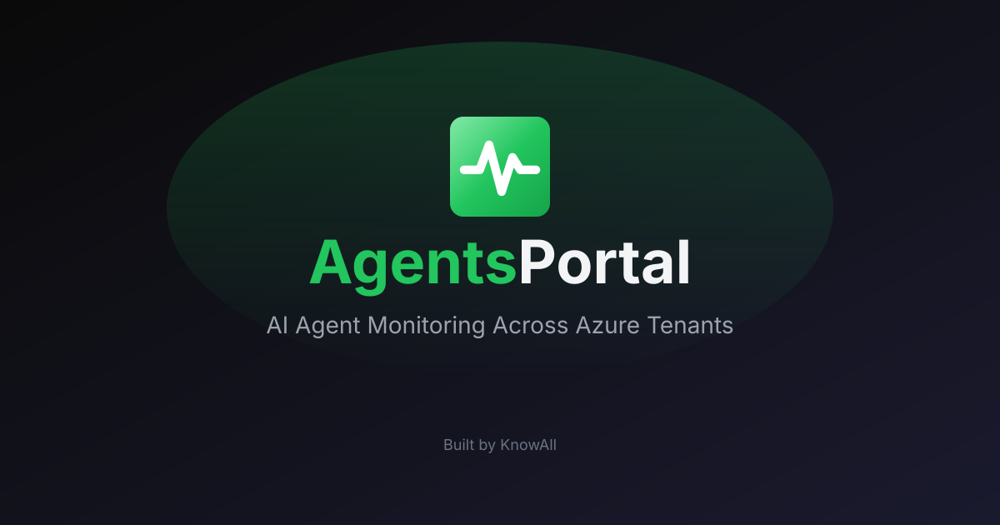
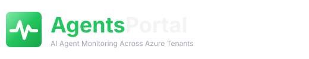

<p align="center">
  <a href="https://agents.knowall.ai">
    
  </a>
</p>

<p align="center">
  <picture>
    <source media="(prefers-color-scheme: dark)" srcset="public/assets/logo.svg">
    <source media="(prefers-color-scheme: light)" srcset="public/assets/logo-light.svg">
    
  </picture>
</p>

<p align="center">
  <strong>AI Agent Monitoring Across Azure Tenants</strong>
</p>

<p align="center">
  <a href="https://agents.knowall.ai">Production</a> •
  <a href="#quick-start">Quick Start</a> •
  <a href="#features">Features</a> •
  <a href="docs/ONBOARDING.adoc">Add an Agent</a> •
  <a href="docs/SOLUTION_DESIGN.adoc">Documentation</a>
</p>

---

**Agents Portal** is the operations view for the AI agents [KnowAll](https://www.knowall.ai) builds and runs — for itself and for its customers. Sign in with Microsoft, and every agent in the Azure subscriptions you can see is listed with its status, skills and recent activity. Built with the same stack and look as [ZapDesk](https://github.com/knowall-ai/zapdesk) and [Thyme](https://github.com/knowall-ai/thyme).

## Features

- **Microsoft Authentication** - Sign in with Microsoft Entra ID; multi-tenant, with a tenant switcher in the header
- **Automatic Discovery** - Agents are found through Azure Resource Graph from tags (`agent=<name>`) or resource groups listed in `config/agents.json`
- **Every Kind of Agent** - OpenClaw agents on VMs (Sallie), Azure AI Foundry assistants (Winnie), Bot Framework bots (Zaplie)
- **Status** - Derived from VM power state and App Service state, confirmed by probing the agent's portal
- **Profile & Teams** - Each agent has an avatar and a _Chat in Teams_ button (agent account or bot)
- **Skills** - Read from the agent's GitHub repo (`SKILL.md` folders) and from the tools wired into its Foundry assistants
- **Recent Activity** - Azure Activity Log events, GitHub commits and AI Foundry runs merged into one feed
- **Azure Lighthouse Aware** - Customer subscriptions delegated to your tenant show up automatically, flagged with a Lighthouse badge
- **No Database** - Everything is read live (and briefly cached) using the signed-in user's own permissions

## How Visibility Works

| You sign in as…                                    | You see…                                                                                                |
| -------------------------------------------------- | ------------------------------------------------------------------------------------------------------- |
| A KnowAll user in the KnowAll tenant               | Agents in KnowAll subscriptions **plus** any customer subscriptions delegated to KnowAll via Lighthouse |
| A KnowAll user who is a guest in a customer tenant | Switch tenant in the header — you then see that tenant's agents only                                    |
| A customer user in the customer's own tenant       | Only the agents in subscriptions they can read                                                          |

Azure Lighthouse delegates **Azure resources** (subscriptions or resource groups), so a customer's agent VMs, App Services, Bot Services and AI Foundry projects appear without leaving your tenant. It does not delegate Microsoft 365, so anything read through Microsoft Graph (Teams, mailboxes) is still per tenant.

## Quick Start

### Prerequisites

- [Node.js](https://nodejs.org/) 20+ (runtime for the server)
- [Bun](https://bun.sh) 1.4+ (package manager)
- An Azure subscription with Reader access to the agents' resource groups
- A Microsoft Entra ID app registration (see below)

### Installation

1. **Clone the repository**

   ```bash
   git clone https://github.com/knowall-ai/agents-portal.git
   cd agents-portal
   ```

2. **Install dependencies**

   ```bash
   bun install
   ```

3. **Configure environment variables**

   ```bash
   cp .env.example .env
   ```

   Edit `.env` with your values (see [.env.example](.env.example)).

4. **Run the development server**

   ```bash
   bun run dev
   ```

5. **Open the application** at [http://localhost:3103](http://localhost:3103)

## Entra ID App Registration

Create a **multi-tenant** app registration so users from any tenant can sign in:

```bash
# 1. Register the app with web redirect URIs (NextAuth callback path)
APP_ID=$(az ad app create \
  --display-name "Agents Portal" \
  --sign-in-audience AzureADMultipleOrgs \
  --web-redirect-uris \
    "http://localhost:3103/api/auth/callback/azure-ad" \
    "https://agents.knowall.ai/api/auth/callback/azure-ad" \
  --query appId -o tsv)

# 2. Delegated permissions:
#    Microsoft Graph        User.Read, User.Read.All (agents' licences), Directory.Read.All (agents' roles, groups,
#                           app registrations and consent), Presence.Read.All (on a call), openid, profile,
#                           email, offline_access
#    Azure Service Mgmt     user_impersonation   (Resource Graph, Activity Log)
#    Azure ML Services      user_impersonation   (AI Foundry Assistants API, https://ai.azure.com)
az ad app permission add --id $APP_ID --api 00000003-0000-0000-c000-000000000000 \
  --api-permissions e1fe6dd8-ba31-4d61-89e7-88639da4683d=Scope 37f7f235-527c-4136-accd-4a02d197296e=Scope \
  9c7a330d-35b3-4aa1-963d-cb2b9f927841=Scope \
    14dad69e-099b-42c9-810b-d002981feec1=Scope 64a6cdd6-aab1-4aaf-94b8-3cc8405e90d0=Scope \
    7427e0e9-2fba-42fe-b0c0-848c9e6a8182=Scope a154be20-db9c-4678-8ab7-66f6cc099a59=Scope \
    06da0dbc-49e2-44d2-8312-53f166ab848a=Scope
az ad app permission add --id $APP_ID --api 797f4846-ba00-4fd7-ba43-dac1f8f63013 \
  --api-permissions 41094075-9dad-400e-a0bd-54e686782033=Scope
az ad app permission add --id $APP_ID --api 18a66f5f-dbdf-4c17-9dd7-1634712a9cbe \
  --api-permissions 1a7925b5-f871-417a-9b8b-303f9f29fa10=Scope

# 3. Service principal, admin consent for your tenant, and a client secret
az ad sp create --id $APP_ID
az ad app permission admin-consent --id $APP_ID
az ad app credential reset --id $APP_ID --display-name local-dev --years 1 --query password -o tsv
```

Put the app ID and secret in `.env` as `AZURE_AD_CLIENT_ID` / `AZURE_AD_CLIENT_SECRET`. Other tenants grant consent once via `https://login.microsoftonline.com/common/adminconsent?client_id=<APP_ID>`.

## Adding an Agent

Agents are discovered from Azure. Either:

1. **Tag the resources** (VM, App Service, Bot Service, AI Services account) with `agent=<slug>`. Optional tags: `agent-customer`, `agent-kind` (`openclaw` | `foundry` | `botframework`), `agent-url`, `agent-repo`, `environment`.
2. **Or add a registry entry** in [`config/agents.json`](config/agents.json) that claims the agent's resource groups and adds a name, customer, portal URL and GitHub repo.

See [docs/ONBOARDING.adoc](docs/ONBOARDING.adoc) for the full walkthrough, including Azure Lighthouse delegation for customer tenants.

## Tech Stack

- **Framework**: Next.js 16 (App Router)
- **Runtime**: Node.js (production), Bun (local development)
- **Package Manager**: Bun
- **Language**: TypeScript
- **Styling**: Tailwind CSS 4
- **Authentication**: NextAuth.js with Azure AD
- **Data Sources**: Azure Resource Graph, Azure Activity Log, Azure AI Foundry Assistants API, GitHub REST API
- **Icons**: Lucide React
- **Deployment**: Azure App Service

## Project Structure

```
agents-portal/
├── config/
│   └── agents.json            # Static agent registry (names, customers, repos)
├── src/
│   ├── app/                   # Next.js app router pages
│   │   ├── api/               # API routes
│   │   │   ├── auth/          # NextAuth endpoints
│   │   │   ├── agents/        # Agent list, detail, skills, activity
│   │   │   ├── activity/      # Merged activity feed
│   │   │   └── tenants/       # Tenant list and switcher
│   │   ├── agents/            # Agent pages
│   │   ├── activity/          # Activity page
│   │   └── login/             # Login page
│   ├── components/            # React components
│   ├── hooks/                 # React hooks
│   ├── lib/
│   │   ├── agents/            # Discovery, grouping and status logic
│   │   └── providers/         # Azure, Foundry, GitHub and health clients
│   └── types/                 # TypeScript types
├── docs/                      # AsciiDoc documentation
├── tests/                     # Playwright tests
└── public/                    # Static assets
```

## Documentation

- [Solution Design](docs/SOLUTION_DESIGN.adoc)
- [Onboarding an Agent](docs/ONBOARDING.adoc)
- [Deployment Guide](docs/DEPLOYMENT.adoc)
- [Testing Guide](docs/TESTING.adoc)
- [Troubleshooting](docs/TROUBLESHOOTING.adoc)

## Development

```bash
bun run dev            # Development server on http://localhost:3103
bun run build          # Production build
bun run start          # Production server
```

### Code Quality Checks

The following checks run on every pull request via GitHub Actions:

```bash
bun run check          # format:check + lint + typecheck + build
bun run test:unit      # Vitest unit tests (discovery / status logic)
bun run test           # Playwright end-to-end tests
```

## License

[MIT](LICENSE) — KnowAll AI.

## Support

For support, email [support@knowall.ai](mailto:support@knowall.ai) or visit [knowall.ai](https://www.knowall.ai).
